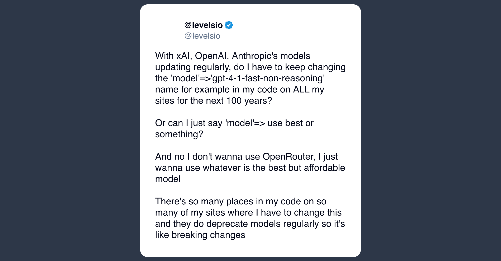

# aimux

[](https://www.npmjs.com/package/@janek26/aimux)
[](https://github.com/janek26/aimux/actions/workflows/ci.yml)
[](LICENSE)

<p align="center">
  <a href="https://x.com/levelsio/status/2050244383845318786">
    
  </a>
</p>

<p align="center">
  <sub>Source: <a href="https://x.com/levelsio/status/2050244383845318786">@levelsio on X</a></sub>
</p>

AI tools all want their own provider config, model names, MCP servers, and local files. aimux keeps that moving target in one config and exposes it as one local gateway: OpenAI-compatible `/v1` for models, plus one muxed MCP endpoint for tools.

Use the same local AI stack across Cursor, Zed, Claude Code, Codex, Gemini CLI, OpenCode, and anything else that speaks OpenAI or MCP.

## Demo

<p align="center">
  
</p>

## Features

- One `.aimux.yml` for providers, model routes, and MCP servers.
- One OpenAI-compatible gateway at `/v1/models` and `/v1/chat/completions`.
- One MCP gateway that muxes tools, prompts, and resources from many servers.
- Client config generation for common AI coding tools.
- User service management for macOS LaunchAgent and Linux systemd.

## Quick Start

```sh
bunx @janek26/aimux@latest help

bun install -g @janek26/aimux

aimux init
aimux llm add fallback --name openai --preset openai --token "$OPENAI_API_KEY"
aimux serve --port 8787
```

After installing globally, use `aimux` directly. `bunx aimux help` also works once the global binary is on your `PATH`.

Then use aimux like an OpenAI-compatible API:

```sh
curl http://localhost:8787/v1/models

curl http://localhost:8787/v1/chat/completions \
  -H 'content-type: application/json' \
  -d '{"model":"gpt-4o-mini","messages":[{"role":"user","content":"Hello"}]}'
```

`init` creates `.aimux.yml`. Config lookup walks up from the current directory, then falls back to `~/.aimux.yml`.

## MCP

```sh
aimux mcp add github \
  --transport stdio \
  --command npx \
  --args "-y,@modelcontextprotocol/server-github" \
  --env "GITHUB_PERSONAL_ACCESS_TOKEN=$GITHUB_PERSONAL_ACCESS_TOKEN"

aimux serve mcp
```

Remote MCP servers can use OAuth, bearer tokens, custom headers, method filters, and method renames.

## Client Config

```sh
aimux generate all
```

Targets: `opencode`, `cursor`, `zed`, `claude-code`, `codex`, and `gemini-cli`.

Generated client config is local machine state and is ignored by git. Zed currently reads `language_models` only from `~/.config/zed/settings.json`; aimux writes project-local Zed MCP config and asks before updating global Zed model settings.

## Service

```sh
aimux service enable
aimux service logs
aimux service load ./path/to/.aimux.yml
aimux service restart
aimux service disable
aimux service uninstall
```

The service runs `aimux serve` against `~/.aimux.yml`. Logs go to `~/Library/Logs/aimux/aimux.log` on macOS and `~/.local/state/aimux/aimux.log` on Linux.

## Config

Do not commit real `.aimux.yml` files. They can contain API keys, MCP headers, OAuth access tokens, and refresh tokens. Use `.aimux.example.yml` as a safe starting point.

```yaml
providers:
  openai-prod:
    preset: openai
    token: <OPENAI_API_KEY>

llm:
  custom/prod:
    provider: openai-prod
    model: gpt-4o
  fallback:
    - provider: openai-prod

mcp:
  local-files:
    transport: stdio
    command: mcp-server-filesystem
    args: ["."]
```

## Compatibility

OpenAI-compatible providers are proxied without rewriting request or response bodies except for configured model remapping. Streaming, tool calls, structured outputs, image inputs, and provider-specific fields pass through when the upstream supports them.

Anthropic providers are adapted through the Messages API for basic chat-completion compatibility. Full Anthropic multimodal and tool-use normalization is future work.

## Development

```sh
bun install
bun run check
bun run build
```

Releases are published exclusively by GitHub Actions through semantic-release. Add `NPM_TOKEN` to the repository secrets before pushing a conventional commit to `main`.

See `docs/PROJECT.md` for architecture notes.

## License

MIT
